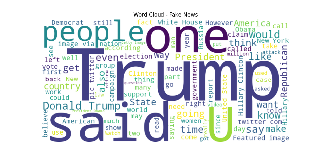
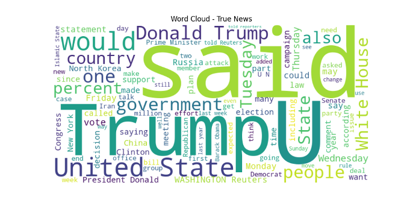
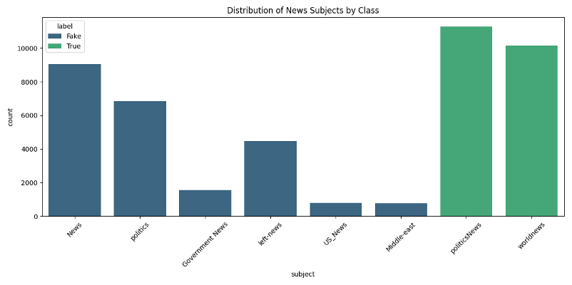
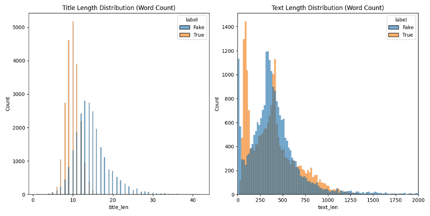

# Clasificación automática de noticias según patrones lingüísticos de las fake news

## Resumen

El objetivo de este trabajo es desarrollar y evaluar modelos de procesamiento de lenguaje natural (NLP) capaces de clasificar artículos periodísticos según patrones asociados a la desinformación. Las herramientas desarrolladas resultan útiles como apoyo a procesos de verificación, siempre que se consideren los sesgos propios del dataset utilizado.

El trabajo pone énfasis en el análisis lingüístico interpretable: la pregunta central no es solo qué modelo clasifica mejor, sino qué características del texto —longitud de oraciones, carga emocional, densidad de entidades, presencia de URLs— distinguen el contenido de desinformación del periodismo tradicional en este corpus. Los modelos de clasificación son el instrumento para validar esos patrones, no el fin en sí mismo.

Para ello, se utilizará un dataset público de aproximadamente 45.000 artículos en inglés recopilados de Reuters. El trabajo abarca desde el preprocesamiento de los textos hasta la implementación y comparación de distintos modelos de clasificación supervisada, evaluando su desempeño mediante métricas estándar, con énfasis en el F2-score dada la asimetría de costos entre falsos positivos y falsos negativos.

## Datos

El dataset seleccionado proviene de la plataforma Kaggle ([Fake and Real News Dataset](https://www.kaggle.com/datasets/clmentbisaillon/fake-and-real-news-dataset/)) y está compuesto por dos archivos principales en formato CSV que suman un total de 44.898 registros:

- **True.csv**: Contiene 21.417 noticias verídicas, recopiladas de Reuters entre 2016 y 2017 inclusive.
- **Fake.csv**: Contiene 23.481 noticias clasificadas como falsas, correspondientes al período 2015-2017 inclusive.

Cada registro cuenta con las siguientes columnas:

- **title**: El titular de la noticia (string).
- **text**: El cuerpo completo del artículo (string).
- **subject**: La temática de la noticia (e.g., política, noticias mundiales).
- **date**: Fecha de publicación.

La distribución de clases es equilibrada (aproximadamente 48% reales vs. 52% falsas), lo que facilita el entrenamiento supervisado. Dado que la columna **subject** actúa como un predictor demasiado fuerte y constituye un sesgo del dataset —las noticias reales se concentran exclusivamente en etiquetas como _politicsNews_ y _worldnews_, mientras que las falsas presentan una mayor diversidad de etiquetas— esta columna será excluida de las features de los modelos.

Adicionalmente, dado que las noticias cuentan con fecha de publicación, las particiones train/validation/test se realizarán de forma temporal (ordenando por fecha), en lugar de aleatorias, para simular mejor un escenario realista de detección.

## Análisis exploratorio

En esta fase, realizamos un estudio descriptivo sobre el dataset de 44.898 registros. En el [anexo](#anexo) se pueden observar los gráficos generados por este análisis. A continuación se detallan los hallazgos principales.

### Estadísticas descriptivas y longitud de los textos

Se observó que las noticias falsas tienden a ser ligeramente más extensas en promedio que las reales.

| Clase  | Registros | Promedio de palabras |
| :----- | :-------- | :------------------- |
| Reales | 21.417    | 385,6                |
| Falsas | 23.481    | 423,2                |

Las distribuciones de longitud ([figura 4](./assets/figura4.png)) muestran que, si bien la mayoría de los artículos se sitúan por debajo de las 1.000 palabras, el conjunto de noticias falsas presenta una mayor variabilidad y una cola más larga de artículos extensos.

### Distribución temática

Existe una clara distinción en el etiquetado de temas entre ambas clases, aunque con cierto solapamiento ([figura 3](./assets/figura3.png)):

- **Noticias Reales**: Se concentran principalmente en _politicsNews_ (53%) y _worldnews_.
- **Noticias Falsas**: Presentan una mayor diversidad de etiquetas: _News_, _politics_ (29%), _left-news_, _Government News_, `US_News` y _Middle-east_.

Esta discrepancia sugiere que la columna **subject** podría ser un predictor demasiado fuerte o un sesgo del dataset original, por lo que será excluida de las features de los modelos.

### Análisis léxico y términos recurrentes

A través de nubes de palabras y tablas de frecuencia ([figura 1](./assets/figura1.png) y [figura 2](./assets/figura2.png)), identificamos patrones clave:

- **Noticias Reales**: El término más frecuente es _"said"_ (64.382 apariciones), seguido de _"trump"_, _"president"_ y _"reuters"_. La presencia constante de la fuente (_"reuters"_) es una potencial fuente de sesgo: los modelos podrían aprender a asociar la mención de la fuente con la etiqueta "real" en lugar de detectar patrones lingüísticos genuinos.
- **Noticias Falsas**: El término predominante es _"trump"_ (73.933 apariciones), seguido de _"said"_, _"people"_ y _"president"_. Se observa una mayor mención de figuras políticas específicas como _"clinton"_, _"obama"_ e _"hillary"_, y el uso de términos como _"via"_ y _"video"_, reflejando el origen de muchas de estas noticias en redes sociales.

### Técnicas de preprocesamiento

Para realizar estos análisis y preparar los datos para los modelos, se implementaron las siguientes técnicas:

- **Normalización**: Conversión de todo el texto a minúsculas.
- **Limpieza**: Eliminación de puntuación, caracteres especiales y números. Las URLs fueron reemplazadas por el token genérico `[URL]`, preservando la información sobre la presencia de enlaces sin introducir ruido léxico.
- **Tokenización**: División del texto en palabras individuales.
- **Stopwords**: Se evaluará el impacto de mantener o eliminar stopwords mediante experimentos comparativos. Se entrenarán modelos en ambas condiciones para cuantificar el efecto de esta decisión.

## Propuesta de análisis

Basándonos en los objetivos planteados, proponemos los siguientes experimentos:

- **Clasificación supervisada con modelos tradicionales**: Entrenar modelos de **Regresión Logística**, **Naive Bayes** y **SVM** utilizando representaciones de **Bag of Words** y **TF-IDF** como línea de base. Incluye una ablación de marcadores de fuente para cuantificar el sesgo del dataset.
- **Clasificación con features lingüísticas interpretables**: Extraer un conjunto de características lingüísticas explícitas y entrenar un clasificador logístico sobre ellas. Incluye la comparación título/cuerpo/combinado para validar la Hipótesis 2.
- **Comparación con modelos de embeddings contextuales**: Implementar modelos basados en embeddings preentrenados (**GloVe**, **Word2Vec**) y Transformers (**DistilBERT**, **BERT**) para la clasificación de las noticias.
- **Análisis de errores y explicabilidad**: Evaluar la **importancia de atributos** e identificar los patrones de error más frecuentes para entender las limitaciones de los modelos.

**Hipótesis de investigación:**

- Las noticias falsas utilizan adjetivos con mayor carga emocional y sensacionalista en comparación con las noticias reales de fuentes periodísticas tradicionales. Esta hipótesis será validada en el Experimento 4, extrayendo los adjetivos más frecuentes por clase y comparando su carga semántica.
- El uso del cuerpo del texto completo permitirá una clasificación más precisa que el uso exclusivo del titular, debido a la mayor riqueza de patrones lingüísticos presentes en el desarrollo de la noticia.
- El rendimiento de los modelos disminuirá significativamente al eliminar los marcadores de fuente (e.g., "reuters") del texto, lo que indicaría que parte de la señal aprendida corresponde a identidad de fuente y no a patrones lingüísticos de desinformación.

## Experimentos

En esta sección se detalla la metodología experimental diseñada para cumplir con los objetivos del trabajo. El objetivo principal es evaluar la capacidad de distintos modelos de NLP para detectar automáticamente noticias falsas a partir del contenido textual, poniendo especial énfasis en qué características lingüísticas del texto resultan discriminativas.

### Preparación del entorno y preprocesamiento de datos

#### Limpieza y normalización

Se aplicará un pipeline de preprocesamiento estándar:

- Conversión de texto a minúsculas.
- Eliminación de caracteres especiales y números.
- Reemplazo de URLs por el token genérico `[URL]`.
- Tokenización del texto.
- Stopwords: se entrenarán modelos en dos condiciones —con y sin eliminación de stopwords— para cuantificar el impacto de esta decisión.
- Evaluación de técnicas de lematización para reducir variaciones morfológicas.

Además, se analizará el impacto de mantener o eliminar elementos como signos de exclamación o palabras en mayúsculas, ya que podrían aportar información relevante para detectar contenido sensacionalista.

#### Partición de datos

El dataset será dividido de forma temporal (ordenando por fecha de publicación):

- 70% entrenamiento (artículos más antiguos)
- 15% validación
- 15% prueba (artículos más recientes)

Esta partición temporal es más representativa de un escenario realista que una partición aleatoria: el modelo se entrena sobre el pasado y se evalúa sobre artículos que no existían en el momento del entrenamiento. Si la partición genera desbalance en la proporción de clases, se ajustará manualmente. El conjunto de validación se utilizará para ajuste de hiperparámetros y detección de overfitting, mientras que el de prueba quedará reservado para la evaluación final.

### Experimento 1: Clasificación con modelos tradicionales (Baseline)

El objetivo de este experimento es establecer una línea base utilizando técnicas clásicas de Machine Learning aplicadas a NLP.

#### ¿Qué experimento se va a realizar?

Se entrenarán distintos modelos supervisados de clasificación:

- Regresión Logística
- Naive Bayes Multinomial
- Support Vector Machines (SVM)

#### ¿Cómo se va a realizar?

**Bag of Words (BoW)**: Representa cada documento mediante la frecuencia bruta de palabras. Sirve como punto de referencia mínimo para evaluar la ganancia de representaciones más sofisticadas.

**TF-IDF**: Pondera cada término por su frecuencia en el documento y su rareza en el corpus global. Se eligió TF-IDF como representación principal frente a BoW simple porque penaliza términos muy frecuentes en todo el corpus (como artículos o preposiciones) que aportan poco poder discriminativo, priorizando los términos que son frecuentes en un documento pero raros en el corpus global. También se evaluará la inclusión de **bigramas**, que permiten capturar expresiones de dos palabras con valor semántico propio (_"breaking news"_, _"white house"_, _"fake account"_) que los unigramas no representan.

#### Entrenamiento y optimización

Los hiperparámetros a explorar son:

- Parámetro de regularización _C_ en Regresión Logística y SVM
- Parámetro de suavizado _alpha_ en Naive Bayes
- Tamaño del vocabulario (`max_features`)
- Configuración de n-gramas (unigramas vs. unigramas + bigramas)

#### Evaluación

Las métricas a reportar serán:

- Accuracy, Precision, Recall, F1-score
- **F2-score** (**métrica principal de comparación entre modelos**)
- Matriz de confusión y curva ROC-AUC

La **F2-score** es la métrica principal porque otorga mayor peso al recall que a la precision: un **falso negativo** (una noticia falsa clasificada como real) es significativamente más dañino socialmente que un **falso positivo** (una noticia real marcada como sospechosa).

#### Sub-experimento: Ablación de marcadores de fuente

Una vez entrenado el mejor modelo del Experimento 1, se analizará si su rendimiento se apoya en la señal de fuente más que en patrones lingüísticos reales. Para ello, se entrenará el mismo modelo en dos condiciones:

- **Condición A**: Texto original (incluyendo menciones de fuentes como "reuters", "ap", "afp").
- **Condición B**: Texto con tokens de fuente normalizados —reemplazando "reuters", "ap", "afp" y similares por el token `[SOURCE]`—.

Se comparará el F2-score entre ambas condiciones. Si la diferencia es grande, se concluirá que el dataset codifica parcialmente identidad de fuente, y el análisis lingüístico de los experimentos siguientes deberá realizarse sobre textos con fuentes normalizadas. Si la diferencia es pequeña, los modelos estarán aprendiendo patrones genuinamente lingüísticos.

#### ¿Por qué se va a realizar?

Este experimento establecerá la referencia inicial del rendimiento usando enfoques tradicionales e interpretables. Los resultados —incluyendo la ablación de fuente— servirán como baseline para comparar con los modelos siguientes y como diagnóstico de la validez del dataset.

### Experimento 2: Clasificación con features lingüísticas interpretables

El objetivo de este experimento es identificar qué características lingüísticas del texto son discriminativas antes de recurrir a representaciones densas, obteniendo resultados interpretables que conecten el EDA con el modelado y que permitan validar las hipótesis del trabajo.

#### ¿Qué experimento se va a realizar?

Se construirá un conjunto de features lingüísticas explícitas y se entrenará un clasificador logístico sobre ellas. Se realizará además un sub-experimento de comparación título/cuerpo/combinado para validar la Hipótesis 2.

#### ¿Cómo se va a realizar?

**Extracción de features**: Se utilizarán las bibliotecas **spaCy** y **VADER** para extraer las siguientes características por artículo:

| Feature             | Descripción y justificación                                                                                                                              |
| :------------------ | :------------------------------------------------------------------------------------------------------------------------------------------------------- |
| `ratio_exclamacion` | Signos de exclamación por oración. El contenido sensacionalista tiende a usar este signo con mucha más frecuencia que el periodismo formal.              |
| `ratio_mayusculas`  | Proporción de palabras completamente en mayúsculas. Indicador de énfasis emocional y urgencia artificial, patrones habituales en fake news.              |
| `long_oracion_prom` | Longitud promedio de oraciones en tokens. Las noticias de Reuters tienden a oraciones más largas y estructuradas que el contenido informal.              |
| `ratio_adj_sust`    | Ratio adjetivo/sustantivo (POS tagging con spaCy). Un ratio alto puede indicar lenguaje más evaluativo y emocional.                                      |
| `sentimiento_vader` | Score de sentimiento compuesto (VADER). Valores extremos (muy positivo o muy negativo) pueden indicar polarización del contenido.                        |
| `densidad_ner`      | Entidades nombradas por oración (spaCy NER). Las fake news en este corpus mencionan figuras políticas específicas con mucha más frecuencia.              |
| `freq_url`          | Frecuencia del token `[URL]` por artículo. Las fake news de origen en redes sociales suelen incluir más referencias a enlaces externos.                  |
| `freq_pronombres`   | Frecuencia de pronombres en 1.ª y 2.ª persona ("I", "you", "we"). El periodismo formal tiende a evitarlos; el contenido informal los usa con frecuencia. |

Se eligió **spaCy** (modelo `en_core_web_lg`) porque sus modelos de inglés fueron entrenados sobre OntoNotes, un corpus de texto periodístico. Esto los hace especialmente precisos para el dominio de noticias, tanto para POS tagging como para NER. Frente a alternativas como NLTK (menos preciso, más lento) o Stanford CoreNLP (difícil de integrar desde Python), spaCy ofrece el mejor balance entre precisión y velocidad para este dominio.

Se eligió **VADER** (Valence Aware Dictionary and sEntiment Reasoner) porque fue diseñado específicamente para texto informal y cargado emocionalmente. Maneja nativamente palabras en MAYÚSCULAS, signos de exclamación repetidos y lenguaje hiperbólico, que son exactamente los patrones esperados en contenido sensacionalista. A diferencia de modelos de sentimiento basados en Transformers, produce un score numérico directamente interpretable y es computacionalmente liviano, lo que lo hace adecuado como feature de entrada a un clasificador externo.

**Clasificador**: Se utilizará **Regresión Logística** (en lugar de Random Forest, SVM o redes neuronales). La elección es deliberada: el objetivo de este experimento no es maximizar la performance sino entender qué features son discriminativas. Los coeficientes de un modelo logístico son directamente interpretables —un coeficiente alto en `ratio_exclamacion` significa que los signos de exclamación predicen contenido falso—, mientras que los modelos de caja negra no permiten esa lectura directa.

**Sub-experimento: Título vs. cuerpo vs. combinado**: Se entrenará el modelo del Experimento 1 en tres condiciones: solo columna _title_, solo columna _text_, y _title + text_ concatenados. Esto valida directamente la Hipótesis 2 y determina dónde viven los patrones lingüísticos más discriminativos.

#### Evaluación

Para las features lingüísticas: reportar los coeficientes del LR por feature, ordenados por magnitud (positivo = asociado a fake, negativo = asociado a real). Para el sub-experimento título/cuerpo: tabla comparativa de F2 entre las tres condiciones. Mismas métricas generales que Experimento 1.

#### ¿Por qué se va a realizar?

Este experimento es el puente entre el EDA y los modelos: permite responder qué propiedades del lenguaje son discriminativas por sí solas. Si un modelo con 8 features interpretables alcanza un F2 competitivo, ese es el resultado lingüístico central del trabajo. Los modelos de representación densa del Experimento 3 quedarán contextualizados respecto de este punto de referencia.

### Experimento 3: Clasificación utilizando embeddings y Transformers

El objetivo de este experimento es analizar si modelos que capturan información semántica y contextual del lenguaje logran mejorar la detección de desinformación respecto del baseline establecido en los Experimentos 1 y 2.

#### ¿Qué experimento se va a realizar?

Se implementarán modelos basados en embeddings preentrenados y arquitecturas Transformer.

#### ¿Cómo se va a realizar?

**Embeddings preentrenados (GloVe, Word2Vec, FastText)**

Cada noticia será representada mediante el promedio de los embeddings de sus palabras, utilizados luego como entrada a un clasificador logístico o SVM. Se utilizarán los vectores **GloVe** preentrenados en Wikipedia + Gigaword (840B tokens, 300 dimensiones): ese corpus incluye texto periodístico de un dominio similar al del dataset, lo que mejora la cobertura de vocabulario. Como punto de comparación se entrenará además un **Word2Vec** propio sobre el dataset, para evaluar si los embeddings específicos del dominio capturan mejor el vocabulario de noticias falsas del período 2015-2017.

**Transformers (DistilBERT, BERT)**

Se utilizarán modelos preentrenados de Hugging Face con fine-tuning sobre el dataset. Se priorizará **DistilBERT** como modelo principal, ya que retiene el 97% del rendimiento de BERT-base con el 60% de sus parámetros y el doble de velocidad de inferencia, lo que lo hace más práctico para fine-tuning en el contexto de un proyecto de curso. BERT-base se entrenará en paralelo para comparación directa. No se utilizarán modelos de mayor escala (RoBERTa-large, GPT, LLaMA) porque el fine-tuning supervisado de clasificación con esos modelos requiere recursos computacionales que exceden el alcance de este trabajo. El entrenamiento incluirá:

- Tokenización utilizando el tokenizer oficial del modelo
- Ajuste de pesos del modelo mediante fine-tuning
- Evaluación sobre el conjunto de validación con early stopping sobre F2-score

#### Entrenamiento y optimización (Transformers)

Los hiperparámetros a ajustar son:

- Learning rate
- Batch size
- Número de épocas (con early stopping sobre el F2-score de validación)
- Warmup steps y scheduler de tasa de aprendizaje

#### Evaluación

Se utilizarán las mismas métricas de los Experimentos 1 y 2, permitiendo comparar directamente todos los enfoques en una misma tabla de resultados.

#### ¿Por qué se va a realizar?

Los modelos Transformer incorporan contexto dentro de cada oración, interpretando el significado de una palabra según el entorno en que aparece. Este experimento busca determinar si esa capacidad contextual mejora significativamente la detección respecto de los enfoques más interpretables de los Experimentos 1 y 2, y si esa mejora justifica la pérdida de interpretabilidad.

### Experimento 4: Análisis de importancia de atributos

Además del rendimiento predictivo, se realizará un análisis interpretativo para identificar qué características lingüísticas son más relevantes en la clasificación de noticias falsas.

#### ¿Qué experimento se va a realizar?

Se analizarán las palabras y patrones lingüísticos con mayor influencia dentro de los modelos entrenados.

#### ¿Cómo se va a realizar?

En modelos lineales (Regresión Logística, SVM lineal):

- Se extraerán los coeficientes asociados a cada término.
- Se identificarán las palabras con mayor peso positivo (asociadas a noticias falsas) y negativo (asociadas a reales).
- Se analizarán adjetivos frecuentes por clase y se comparará su carga semántica, para validar la hipótesis sobre el lenguaje emocional.

También se analizarán n-gramas relevantes y expresiones asociadas a contenido sensacionalista. Los resultados se visualizarán mediante tablas y gráficos comparativos.

#### Evaluación

Se analizará si los términos con mayor peso positivo corresponden a lenguaje emocional, sensacionalista o políticamente cargado, y si los de mayor peso negativo reflejan el estilo periodístico formal. Se verificará también si los atributos más relevantes son consistentes entre distintos modelos.

#### ¿Por qué se va a realizar?

Este análisis permitirá interpretar qué características lingüísticas aparecen asociadas a noticias falsas y validar hipótesis surgidas durante el análisis exploratorio.

### Experimento 5: Análisis de errores

El objetivo de este experimento es estudiar los casos donde los modelos fallan para detectar posibles limitaciones y oportunidades de mejora.

#### ¿Qué experimento se va a realizar?

Se realizará un análisis manual de falsos positivos y falsos negativos.

#### ¿Cómo se va a realizar?

Se seleccionarán ejemplos incorrectamente clasificados y se analizarán posibles causas del error:

- Títulos o textos ambiguos
- Ironía o sarcasmo
- Lenguaje neutral en noticias falsas
- Presencia de información parcialmente verdadera

También se compararán los errores entre modelos tradicionales y Transformers.

#### Evaluación

Se seleccionará una muestra representativa de al menos 30 ejemplos mal clasificados (balanceando falsos positivos y falsos negativos) del mejor modelo obtenido en los Experimentos 1, 2 y 3. Cada caso será analizado manualmente, categorizándolo en una taxonomía predefinida (e.g., lenguaje neutral en noticia falsa, fuente ambigua, ironía). Se reportará la distribución de categorías de error y se comparará entre el mejor modelo tradicional y el mejor Transformer.

#### ¿Por qué se va a realizar?

Este análisis permitirá entender mejor las limitaciones de cada enfoque y detectar situaciones donde los modelos tienen dificultades para capturar el contexto o la intención del texto.

## Anexo

Gráficos generados durante el análisis exploratorio de datos.

### Figura 1 — Word Cloud de Fake News

[Ver imagen](./assets/figura1.png)

### Figura 2 — Word Cloud de True News

[Ver imagen](./assets/figura2.png)

### Figura 3 — Distribución de noticias por subject

[Ver imagen](./assets/figura3.png)

### Figura 4 — Distribución de longitud de texto de título/contenido

[Ver imagen](./assets/figura4.png)

